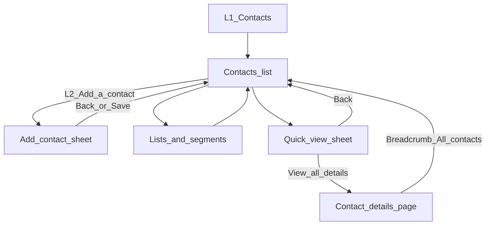

# Contacts — New gen exploration

Single source of truth for **Contacts** prototype scope: Figma file [New gen exploration](https://www.figma.com/design/lY44qEJoH7y0DOq4SBs1yr/New-gen-exploration?node-id=563-573), scope entry node **`563-573`**.

**Flow boundary:** The in-repo prototype implements **in-app Contacts only** (L2 rail + main canvas + right sheets + full-width contact details). It does **not** navigate to other `AppView` routes (e.g. global Settings) unless those flows are added to the app shell later.

**Canonical implementation note:** Multiple frames may exist in the file; the **reference layouts** in the product plan (§1a–§1d) are treated as canonical for structure and copy until Dev Mode overrides are captured here with new node ids.

---

## 1. Screen catalog

| # | Screen name (Figma / reference) | Node id | Type | Entry | Exit actions | Notes |
|---|----------------------------------|---------|------|--------|----------------|-------|
| 1 | Contacts — All contacts (list) | `563-573` (scope entry; confirm in Dev Mode) | List | L1 → Contacts; L2 **All contacts** | Row → Quick view; L2 **Lists & segments**; L2 **Add a contact** | Header count; columns: contact name, channel, experience score, location; **Lead** pill; pagination mock. |
| 2 | Quick view (drawer) | Tied to list selection (confirm frame id in file) | Right sheet | Row click on list | **Back**; **View all details**; overlay click / close | Mutex with Add contact sheet. `Sheet` right, dimmed backdrop. |
| 3 | Contact details (full page) | Tied to Quick view / list (confirm frame id) | Full-width subview | Quick view → **View all details** | Breadcrumb **All contacts** → list | Two-column layout: sticky profile + tabs/activity (mock). Not a second `Sheet`. |
| 4 | Lists & segments — Saved | Same page section as AI tab | Sub-view + tab | L2 **Lists & segments** → tab **Saved** | L2 **All contacts**; inner tab switch | Table mock; counts in tab badge. |
| 5 | Lists & segments — AI Recommendations | Same page section as Saved tab | Sub-view + tab | L2 **Lists & segments** → tab **AI Recommendations** | L2 **All contacts**; inner tab switch | Purple AI banner below tabs; table includes zero-count rows. |
| 6 | Add a contact | Distinct right sheet | Sheet | L2 **Add a contact** (+ row) | **Back**; **Save** (prototype toast + close) | Form: identity, communication prefs, custom fields. Mutex with Quick view. |
| 7 | L2 rail — Contacts | `563-573` area (confirm) | Navigation | Contacts product | Same as list exits | **Add a contact**, **All contacts**, **Lists & segments**, **Settings** (collapsible); footer usage card. |

### Non-screen assets (components)

| Asset | Node id | Where used |
|-------|---------|------------|
| Table row (hover / selected / default) | Confirm in file | All contacts, Lists tables |
| `Sheet` / overlay pattern | DS + `sheet.v1` | Quick view, Add contact |
| Lead / channel / score chips | Confirm | List rows |

*Update the “confirm” node ids after a Dev Mode pass; keep this table as the catalog master.*

---

## 2. User flow (narrative)

1. User opens **Contacts** from L1 → main shows **All contacts** (default L2 selection).
2. **L2 → Add a contact** opens the **Add a contact** sheet; **Back** or overlay dismiss returns to the list without persisting (except **Save** prototype: toast + close + optional mock row — currently toast + close only).
3. **L2 → Lists & segments** swaps the main canvas to the lists/segments sub-view; **Saved** / **AI Recommendations** tabs are inner state. **L2 → All contacts** restores the list and clears full-page details.
4. **List → row** opens **Quick view** (right sheet) for that contact; **Back** closes the sheet.
5. **Quick view → View all details** opens the **Contact details** full-page view and closes the sheet.
6. **Contact details → breadcrumb “All contacts”** returns to the list and clears the selected detail contact.
7. **Mutex:** `quickView` and `addContact` sheets do not stack; changing L2 item closes overlays and clears quick-view selection as implemented in `App.tsx`.

---

## 3. Flow diagram

---

## 4. Token and component mapping (summary)

### All contacts list

| Region | Primitives / notes | Tokens (semantic) |
|--------|-------------------|---------------------|
| Page background | `div` | `bg-background` |
| Header | Typography + `Button` | `text-foreground`, `border-border` |
| Table | `Table`, `TableHeader`, `TableRow`, `DropdownMenu` | `bg-muted/50` header band, `border-border`, `text-muted-foreground` headers |
| Lead pill | `Badge` | Sentence case **Lead**; `secondary` / outline per DS |
| Pagination | `Button` outline | `border-border`, `bg-primary` active page (match DS button) |

### Quick view sheet

| Region | Primitives | Tokens |
|--------|------------|--------|
| Overlay | `Sheet` overlay | `bg-black/50` (from `sheet.v1`) |
| Panel | `SheetContent` | `bg-background`, `border-border`, `shadow-lg` |
| AI strip | `div` callout + `Button` | `bg-accent/30`, `border-border` or `border-accent`; primary CTA `bg-primary` `text-primary-foreground` |
| Sections | `Collapsible`, `Separator` | `text-muted-foreground` labels, `text-foreground` values |

### Contact details page

| Region | Primitives | Tokens |
|--------|------------|--------|
| Breadcrumbs | `Breadcrumb` | `text-muted-foreground` / `text-foreground` |
| Left column | `Avatar`, `Button`, `Collapsible` | `bg-card`, `border-border` |
| Main column | AI banner, `Tabs`, filters `Select`/`Input`, timeline | Same accent/primary mapping as above; `bg-muted` for subtle bands |

### Lists & segments

| Region | Primitives | Tokens |
|--------|------------|--------|
| Tabs | `Tabs`, `Badge` counts | `border-border`, active tab `text-primary` / underline per `tabs.v1` |
| AI banner | `div` + icon | `bg-accent/25`, `border-border` |
| Tables | `Table` | Same as list |

### Add contact sheet

| Region | Primitives | Tokens |
|--------|------------|--------|
| Form | `Input`, `Label`, `Checkbox`, `Select`, `Separator`, `ScrollArea` | Form surfaces `bg-background`; borders `border-input` / `border-border` |

### Exceptions

- L2 rail continues to use **`L2NavLayout`** token strings (`L2_ROW_SELECTED_BG`, etc.) for parity with the app shell; migrating L2 to full `theme.css` semantics is **out of scope** for this prototype pass.
- Experience score chips retain **traffic-light** backgrounds for quick scanning; if DS adds semantic score tokens, remap later.

---

## 5. Implementation wiring (code)

| Concern | Location |
|---------|----------|
| L2 controlled state, sheet mutex, detail id | `src/app/App.tsx` |
| Contacts L2 + usage footer | `ContactsL2NavPanel` in `src/app/components/Sidebar.v2.tsx` |
| L2 layout footer slot | `footerSlot` on `L2NavLayout` in `src/app/components/L2NavLayout.v1.tsx` |
| Main surfaces + sheets + details | `src/app/components/ContactsView.v1.tsx` |
| Storybook | `src/stories/ContactsView.stories.tsx` only (§4.5) |

---

## 6. Storybook verification (§4.5)

- Extend **only** `ContactsView.stories.tsx` with variants for: default list, Quick view open, Add contact open, Lists & segments (both tabs), Contact details, and optional **controlled shell** demos for reviewers.
- Resolve primitives against existing **Design System** stories before diverging.
- Check **Design System → Tokens** and the theme toolbar (light/dark) when validating new surfaces.
